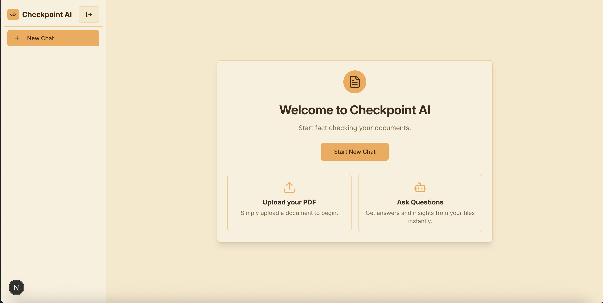

# Checkpoint AI

Checkpoint AI is an intelligent document analysis and verification platform. It leverages advanced AI models to extract information from PDF documents, evaluate claims, and provide evidence-backed answers to user queries. The application consists of a modern, responsive frontend built with Next.js and a robust backend API powered by FastAPI and Google's Gemini models.

## Table of Contents

- [Project Overview](#project-overview)
- [Project Structure](#project-structure)
- [Application Info](#application-info)
- [Getting Started](#getting-started)

## Project Overview

Checkpoint AI allows users to upload documents (such as research papers or reports) and automatically verifies the claims made within them. The system scores these claims, provides explanations, and cites sources, effectively acting as a "checkpoint" for information integrity. Users can also interact with the document context through a Q&A interface.

## UI Screenshots

### Dashboard



### New Chat Interface


### AI Fact Checking


## Project Structure

The project is divided into two main components:

- **frontend/**: A Next.js 15 application providing the user interface, authentication, and chat capabilities.
- **server/**: A Python FastAPI backend that handles PDF processing, AI generation, and reasoning logic.

```
checkpoint-ai/
├── frontend/       # Next.js frontend application
├── server/         # FastAPI backend application
└── sample_images/  # Screenshots and demo images
```

## Application Info

- **Frontend Platform**: Web (Next.js)
- **Backend API**: REST (FastAPI)
- **AI/ML Engine**: Google Gemini (via Google GenAI SDK)
- **Authentication**: Firebase Auth

## Getting Started

Follow these steps to set up and run the project locally.

### Prerequisites

- **Node.js** (v18+)
- **Python** (v3.10+)
- **Google Gemini API Key**
- **Firebase Project** (for authentication)

### Installation

**Clone the repository:**

```bash
git clone https://github.com/Hachiman-potassiumdesu/checkpoint-ai.git
cd checkpoint-ai
```

### 1. Backend Setup (Server)

Navigate to the `server/` directory to set up the Python environment.

```bash
cd server

# Create and activate virtual environment
python -m venv venv
source venv/bin/activate  # Windows: venv\Scripts\activate

# Install dependencies
pip install -r requirements.txt
```

**Configuration:**

Create a `.env` file in the `server/` directory with your Google API key:

```env
GOOGLE_API_KEY=your_google_api_key_here
```

**Run Server:**

```bash
python server.py
```

The backend will start at `http://0.0.0.0:8000`.

### 2. Frontend Setup (Client)

Open a new terminal, navigate to the `frontend/` directory, and install dependencies.

```bash
cd frontend
npm install
```

**Configuration:**

Create a `.env.local` file in the `frontend/` directory with your Firebase and API details:

```env
NEXT_PUBLIC_API_URL=http://localhost:8000
NEXT_PUBLIC_API_KEY=your_firebase_api_key
NEXT_PUBLIC_AUTH_DOMAIN=your_project_id.firebaseapp.com
NEXT_PUBLIC_PROJECT_ID=your_project_id
NEXT_PUBLIC_STORAGE_BUCKET=your_project_id.firebasestorage.app
NEXT_PUBLIC_MESSAGING_SENDER_ID=your_messaging_sender_id
NEXT_PUBLIC_APP_ID=your_app_id
```

**Run Client:**

```bash
npm run dev
```

The application will be available at `http://localhost:3000`.

---

For detailed instructions, refer to the `README.md` files in the respective `frontend/` and `server/` directories.
